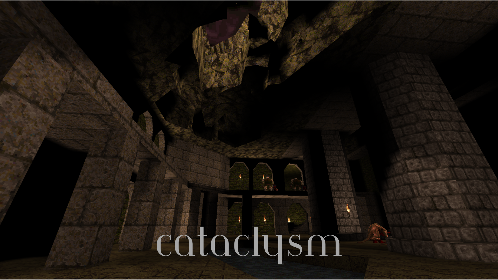
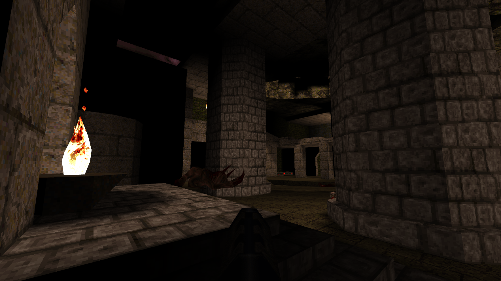

# Projects

A somewhat comprehensive list of all the projects i've worked on or am working on

## Gamedev/Modding

### New World

a garry's mod map i originally made to practice detailing, one of my proudest creations.

### Slaughter Processing

A doom 2 slaughter map with a bad reputation (it sucks). Honestly the mapping got away from me on this one but i don't mind too much since i'm still proud of a few places

### Cataclysm 

A quake map made in about a week, features a lot of cramped level design but i'm still fairly proud of it

### Godot Village/City Demo

A small demo level i made while playing around with qodot, and later nuclide but that didn't pan out like i though). Honestly one of my proudest achievements.

## 3D Renders

I've produced a few of these, most of them look pretty rough though

#### Night park

#### Lakeview

#### Maintenance

